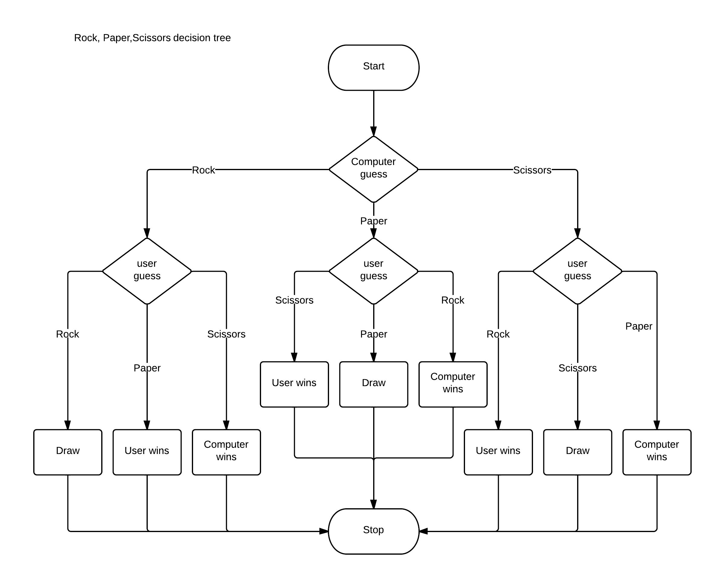

# Project: Rock Paper Scissors | The Odin Project

## Getting Started:
In this project I will make basic functions and algorithms based on infamous game &mdash; Rock Paper Scissors. This program will not have Graphical User Interface (GUI) yet or is just the back-end but the GUI and other changes will be implemented as I progress in later lessons in JavaScript course in [The Odin Project: Foundations Course](https://www.theodinproject.com/paths/foundations/courses/foundations). So for now, this will be played via the devtools console.

## Demo


## Documentation
<strong>Flowchart:</strong> <br>
 <br>
<br>
<strong>Pseudocode:</strong>
```
// Start
Alert message “let’s play”

// Computer choice logic
Computer randomly chooses a number between 3 choices
If computer is equal to 0 then return “rock”
If computer is equal to 1 then return “paper”
Else return “scissors”

// User choice logic
Input prompt user choice
Return user choice

// Initialize score and round variables
Let the default value of computer score is equal to 0
Let the default value of user score is equal to 0
Let the default value of round is 1

// Entire game logic
For loop (or iterate) the round logic for 5 times
Let the user selection is equal to run the user choice logic
Let the computer selection is equal to run the computer choice logic
	// Round logic
	Take the user and computer choice as arguments
	Let the user choice is equal to run `toLowerCase` method its own
	Print the round and its number
	Print the user and computer choice
	// Compare choices for result
	If user and computer both choices are equal then it is draw
	If user is rock and if computer is scissors then run win else lose
	If user is paper and if computer is rock then run win else lose
	If user is scissors and if computer is paper then run win else lose
	// Win function
	Increment user score by 1
	Print user win
	Print user and computer score
	// Lose function
	Increment computer score by 1
	Print computer win
	Print user and computer score

// Round
Increment round by 1

// Game
Call the entire game logic
```