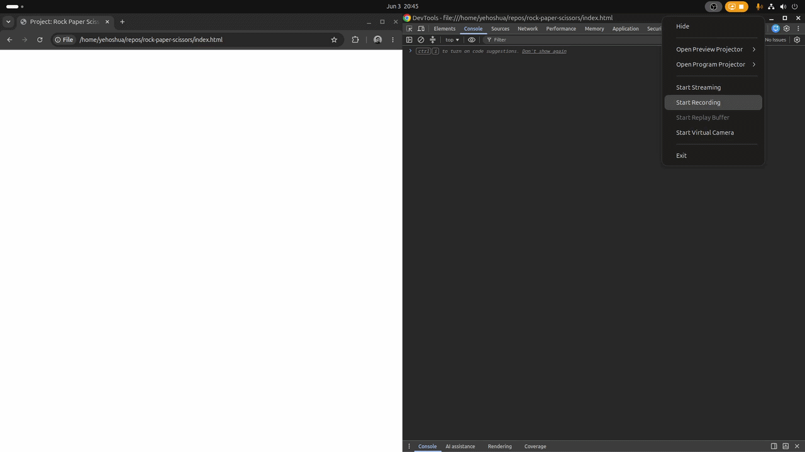
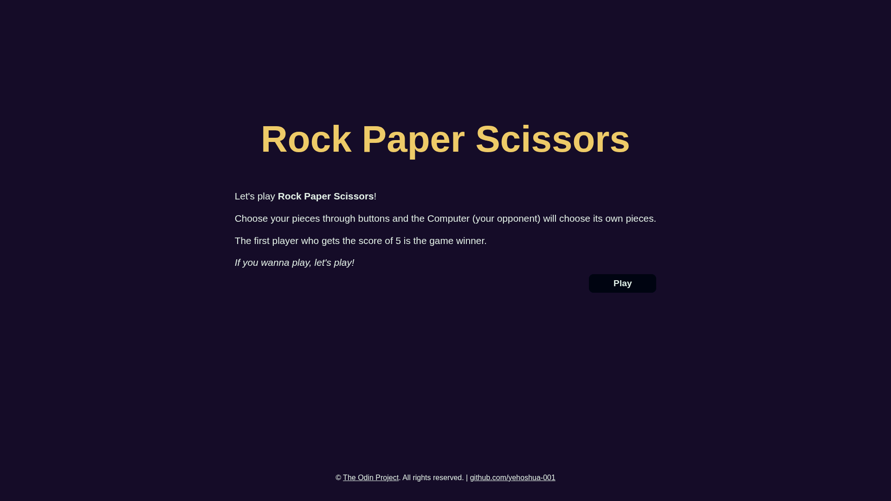
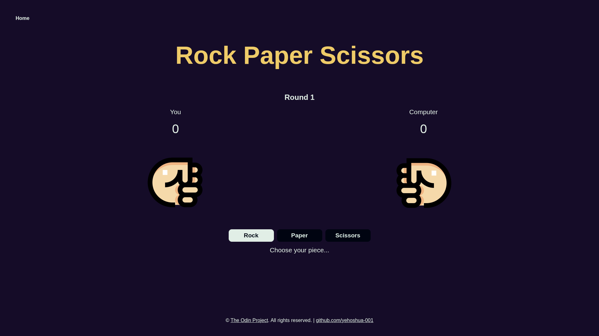
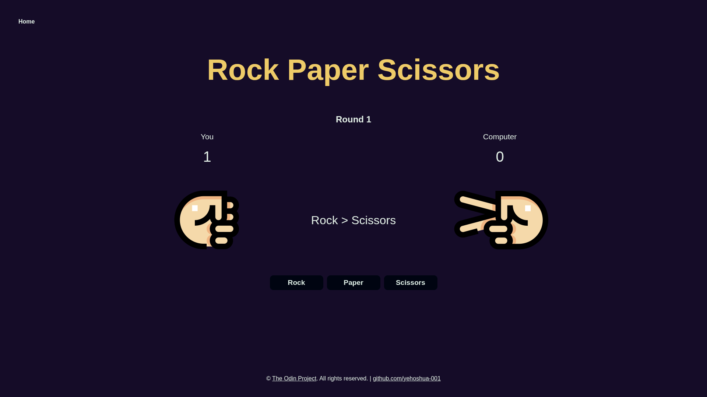
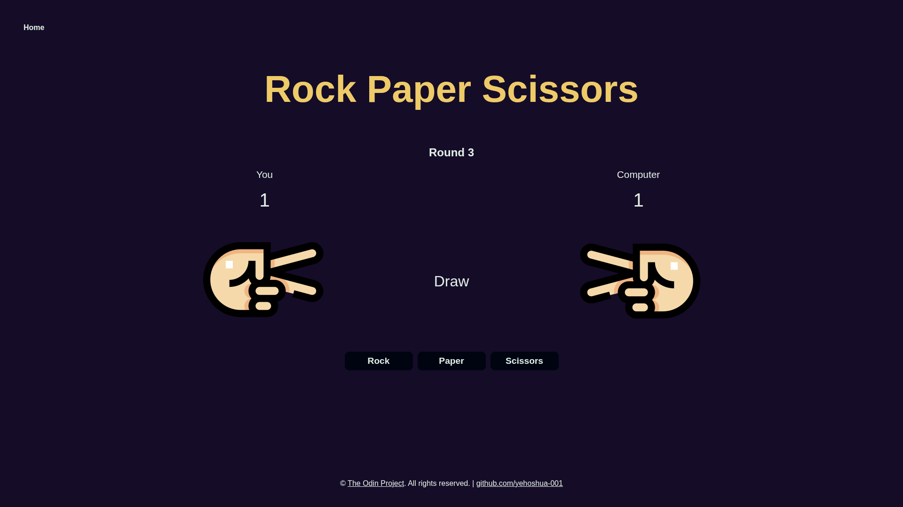
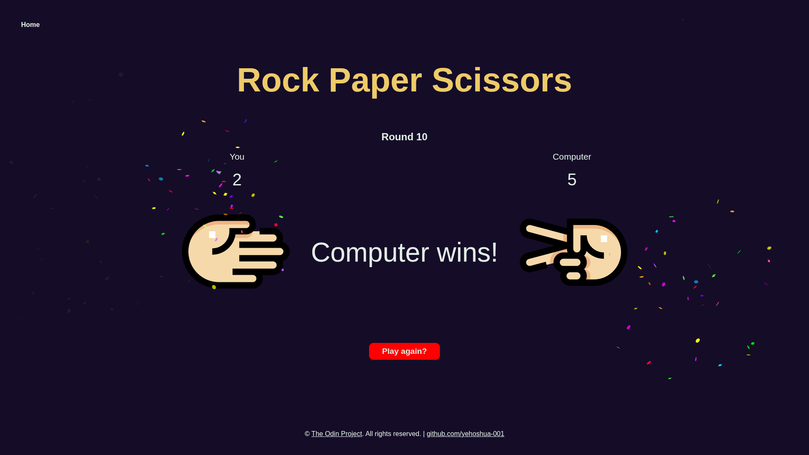

# Project: Rock Paper Scissors | The Odin Project

## Getting Started
In this project I will make functions, logics, and algorithms based on infamous game &mdash; Rock Paper Scissors. I will apply the skills I learned in JavaScript and Document Object Model (DOM) manipulation and events in [Foundations Course of The Odin Project](https://www.theodinproject.com/paths/foundations/courses/foundations), to achieve whatever my desired results.

## Gameplay Demo
 

## How to play
Method 1:
- Access the game through its github-page: https://yehoshua-001.github.io/rock-paper-scissors/

Method 2:
1. Clone the repository in your local computer.
2. Open the 'index.html' file in your web browser.

## Sample Images

## Conclusion
I managed to apply and demonstrate my skills in JavaScript and DOM manipulation and events, I also practiced how to refactor code, fixed functions, logics, and algorithms, comments, and improved the readability of the code.

## Reference
<strong>Hand icons</strong> &mdash; https://www.flaticon.com/free-icon/rock-paper-scissors_6727646 
 
<strong>Confetti effects</strong> &mdash; https://confetti.js.org/ 
